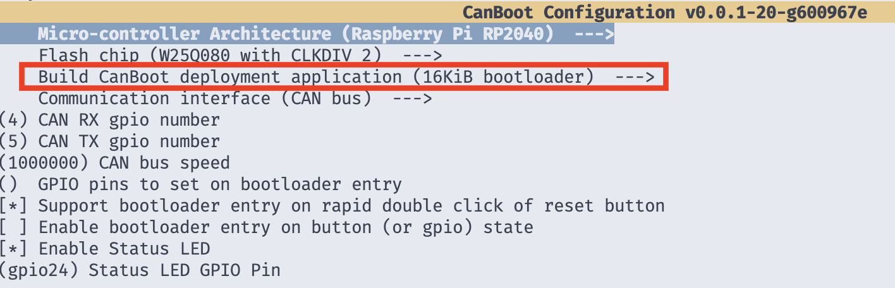

# CanBoot Deployment Application
## Using CanBoot to update CanBoot

[[Back to table of contents]](../README.md)

### What is CanBoot Deployment Application?
> An application that one may run via an existing bootloader and this application will flash CanBoot to the start of flash. This can make it easier to flash CanBoot as it can avoid the need for an stlink, openocd, or similar low-level flashing tool. It also makes it easier to develop CanBoot itself, as one can use an existing installation of CanBoot to flash a new version of CanBoot.
>
> --Kevin O'Connor

&nbsp;

### Steps I performed:

[Configure and make CanBoot](#Configure and make CanBoot)

[Flash Canboot Deployment Application](#Flash CanBoot Deployment Application)

[Next steps]()

-----

### Configure and make CanBoot

- Configure CanBoot  (along with the CanBoot Deployment Application):

  ```sh
  cd ~/CanBoot
  make menuconfig
  ```

  

- Configuration settings:

  ​	

- When done, type "Q" to quit, and then answer "Y" to save the configuration

- Build CanBoot and the CanBoot Deployment Application:

  ```sh
  make
  ```


- If all went well, then you will see something like this:

  ​	

  - As you can see, this creates three files: `out/canboot.bin`, `out/canboot.uf2`, and `out/deployer.bin` which is the CanBoot Deployment Application
  
  

-----


### Flash CanBoot Deployment Application

- First, we must stop Klipper on the host computer:

  ```sh
  sudo service klipper stop
  ```

  

- Next, flash the CanBoot Deployment Application:

  ```sh
  cd ~/CanBoot/scripts
  python3 flash_can.py -i can0 -f ~/CanBoot/out/deployer.bin -u 15f343b33a0b
  ```


- If all went well, then you will see something like this:

  ​	

  - At this point the blue LED next to the SB2040 boot button should be flashing, which means that CanBoot was properly deployed/flashed.
  - Please note that when the `flash_can.py` script sent the bootloader jump command on the CAN bus, we see the UUIDs for all the CAN nodes on the CAN bus. For my CAN bus that UUID is `15f343b33a0b`, but your UUID will be different.
  

&nbsp;

- Additional check to see if the SB2040 is set to CanBoot via a command line command:

  ```sh
  cd ~/CanBoot/scripts
  python3 flash_can.py -i can0 -q
  ```

  


- You just used CanBoot to update CanBoot on the SB2040...


&nbsp;

-----

&nbsp;

### Next Steps

At this point the CanBoot bootloader is active on the SB2040 CAN toolhead.

Please be aware that Klipper will not be able to connect with the SB2040 CAN toolhead while the bootloader is active.

To reset the SB2040 so that it is available to Klipper, you will have to use CanBoot to build and flash Klipper firmware to the SB2040. You can do that by starting following these steps [here](./install_configure_canboot.md/#Build-Klipper-for-the-SB2040).

&nbsp;

[[Back to table of contents]](../README.md)
