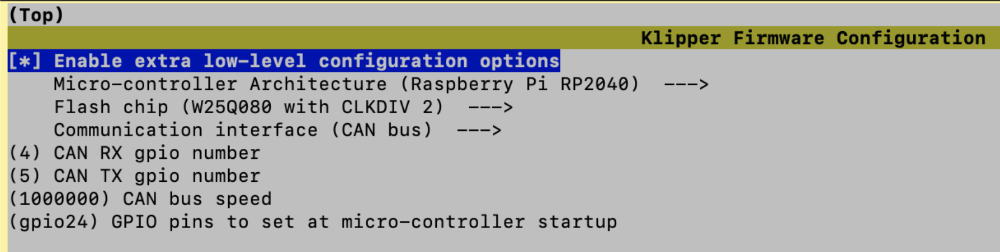

# Setting up the SB2040 + CAN on my RPi 4B

### Steps I performed:
 - [Build Klipper firmware for SB2040](#Build Klipper firmware for SB2040)
	 - I use a UTOC-1, I don't use my Octopus as a CAN Bridge...
	 - Please be aware that CanBoot is not part of these notes
	 - However, I added CanBoot on the SB2040 at a later date...
 - [Burn Klipper firmware on SB2040](#Burn Klipper firmware on SB2040)
 - [Configure CAN networking on the RPi](#Connect SB2040 and establish/configure CAN network)
 - [Update Klipper printer configuration](#Update Klipper printer configuration)
----
#### Build Klipper firmware for SB2040

Test

-   These steps are based on information from [Mellow Flash SB2040 Documentation](http://mellow.klipper.cn/?spm=a2g0o.detail.1000023.17.1c827885mk7TEM#/board/fly_sb2040/flash)
-   Turn on RPi and SSH into the RPi
-   Change directories to the klipper directory:
	```sh
	cd ~/klipper
	```


-   Build Klipper firmware:
	-   First, configure what you want to "make"
		```sh
		make menuconfig
		```
		- Screenshot of the settings I used: 
			

	- Second, build the Klipper for the SB2040
		```sh
		make -j4
		```
	
	-   This creates file "`~/klipper/out/klipper.u2f`”

---
#### Burn Klipper firmware on SB2040

-   These steps are based on information from  [Mellow Flash SB2040 Documentation](http://mellow.klipper.cn/?spm=a2g0o.detail.1000023.17.1c827885mk7TEM#/board/fly_sb2040/flash)
-   Starting state is as follows:
	- RPi is turned on
	- SB2040 is not plugged into anything
- Get the USB-A to USB-C cable and plug the USB-A end of the cable into the RPi
- Press and hold the boot button on the SB2040 while plugging in the USB-C end of the cable to the SB2040
- Continue to hold the boot button for three seconds and then release it
- Check to see if you can see the SB2040:
	```sh
	lsusb
	```
-   Look for “Raspberry Pi RP2 Boot” and make note of the ID value
	-   I did not see that description, but I did see the following new entry:
		
	- Based on my experience, it appears that all SB2040 boards have USB ID "`2e8a:0003`"
- Time to burn the Klipper firmware on the SB2040:
	```sh
	cd ~/klipper
	make flash FLASH_DEVICE=2e8a:0003
	```
- If all worked well then the LED next to the boot button on the SB2040 is lit, and remains lit
	- Unplug the USB cable from the USB-connector on the SB2040

---
#### Connect SB2040 and establish/configure CAN network
First, physically connect the SB2040:
-   Safely turn your printer off
-   Put jumper on SB2040 120 ohm resistor pins
	-   UTOC-1 does not need jumper (built-in on UTOC-1)
-   Connect RPi to UTOC-1 (USB-A to USB-C)
-   Connect SB2040 to UTOC-1 (Four-wire CAN cable)
-   Connect Voron PSU 24V & Ground to UTOC-1
	-   I made a power cable for 24V DC (one side spade connectors, other side ferrules)

Second, define CAN network:
-   Turn printer on
-   SSH into RPi
- There are many ways to configure the CAN network, but I configured mine as follows:
	- Bus speed set to `1000000` 
	- Queue length set to `1024`
-   Define  the CAN network (I used `vi`, but you can you can use your favorite editor)
	```sh
	sudo vi /etc/network/interfaces.d/can0
	```
	Type in the following text:
	```sh
	allow-hotplug can0
	iface can0 can static
	 bitrate 1000000
	 up ifconfig $IFACE txqueuelen 1024
	 pre-up ip link set can0 type can bitrate 1000000
	 pre-up ip link set can0 txqueuelen 1024
	```
	 If you used `vi` then save the file by hitting the `Escape` key, followed by `:wq`, followed by the `return` key.
- Safely restart the printer
	
---
#### Update Klipper printer configuration
*First, find SB2040 UUID*

Execute the following command:
```sh
sudo python ~/klipper/scripts/canbus_query.py can0
```


>**NOTE:** If you receive an `ImportError: No module named can` error, then execute the following command to install the missing module:
``
sudo apt install python-can
``
After installing the missing module, re-execute command `sudo ~/klipper/scripts/canbus_query.py can0`

Make a note of the UUID, because you will need it for the Klipper configuration.

>**NOTE:** This command only works if you have never installed Klipper on the SB2040. Once you install Klipper, this command will no longer display the UUID.

##

*Second, update Klipper printer configuration file*

**NOTE:** These are settings for my Voron 2.4r2 printer and my SB2040. Your settings most likely will be slightly different, based on how you wired your components to your SB2040. Please do not blindly copy and paste...

I used Mainsail to update my `printer.cfg` configuration file.

- Added SB2040 as a new MCU named "sb2040":
	```
	[mcu sb2040]
	canbus_uuid: d063055012c2
	```

- Updated `[adxl345]` section as follows:
	```
	[adxl345]
	cs_pin: sb2040:gpio1
	spi_software_sclk_pin: sb2040:gpio0
	spi_software_mosi_pin: sb2040:gpio3
	spi_software_miso_pin: sb2040:gpio2
	```

- Since I moved my X-Endstop to the X-Carriage, I updated `[stepper_x]` section as follows:
	```
	endstop_pin: sb2040:gpio29
	```

- Updated `[extruder]` section as follows:
	```
	step_pin: sb2040:gpio9
	dir_pin: sb2040:gpio10 
	enable_pin: !sb2040:gpio7
	heater_pin: sb2040:gpio6
	sensor_pin: sb2040:gpio27
	```

- Updated `[tmc2209 extruder]` section as follows:
	```
	uart_pin: sb2040:gpio8
	```

- Updated `[probe]` section as follows:
	```
	pin: sb2040:gpio28
	```

- Updated `[fan]` section for Part Cooling Fan as follows:
	```
	pin: sb2040:gpio13
	```

- Updated `[heater_fan hotend_fan]` section for Hot End Fan as follows:
	```
	pin: sb2040:gpio14
	```

- Added `temperature_sensor toolhead]` section for SB2040 MCU temperature:
	```
	[temperature_sensor toolhead]
	sensor_type: temperature_mcu
	sensor_mcu: sb2040
	```

- Updated `[neopixel sb_leds]` section as follows:
	```
	[neopixel sb_leds]
	pin: sb2040:gpio12
	```

- Save your configuration file and restart

- Final checks after restart
	-  Using the Mainsail UI, start the Part Cooling Fan to make sure that it is working as expected
	-  Manually set the hot end temperature to 80C to see if the Hot End Fan turns on
		- If it does not turn on, then immediately turn off the hot end
	- Perform a PID calibration check for the hot end

Enjoy!

