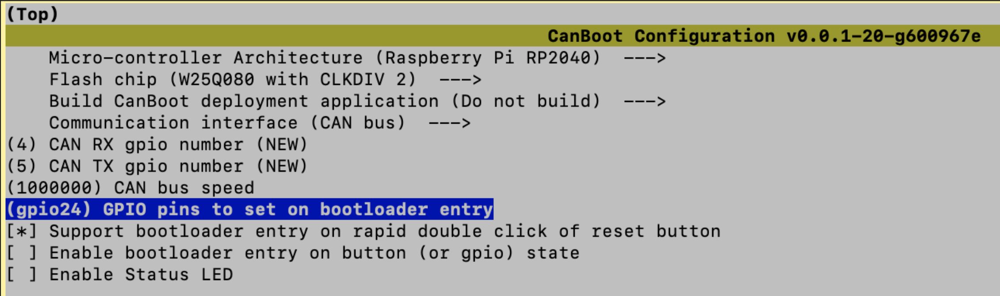
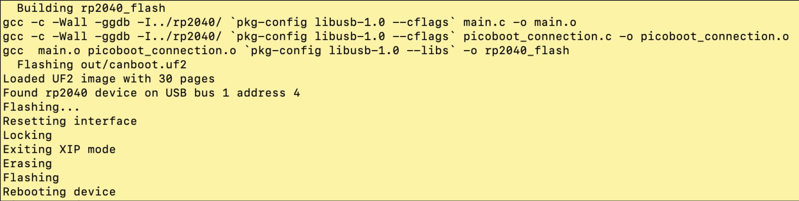
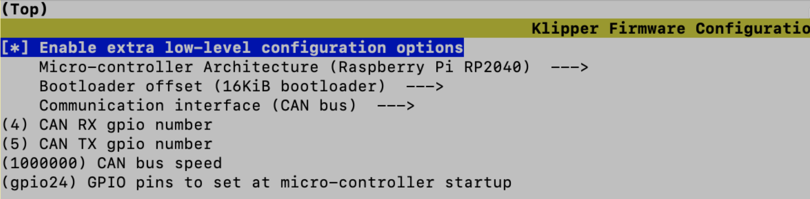
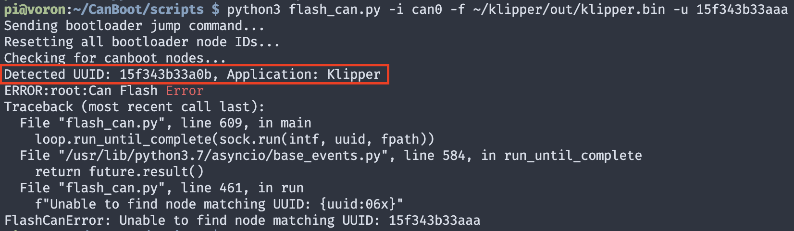
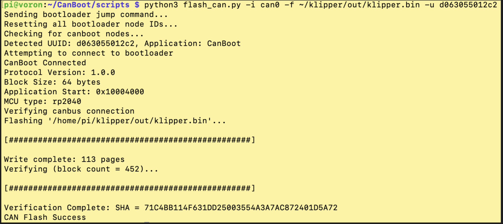

# Setting up the SB2040 + CanBoot on my RPi 4B

[[Back to table of contents]](../README.md)

### CanBoot? Why?

You don't "need" CanBoot...  In my opinion, it is purely a "quality of life" thing... 

If you don't have CanBoot and you need to update Klipper on the SB2040, you "just" have to do the following:

1. Move print head to front of printer 
2. Unplug CAN cables from SB2040
3. Put printer on its side to get access to electronics bay
4. Find a USB-A to USB-C cable
5. Plug the USB-A side into an open port on the RPi
6. Push in the boot button on the SB2040 while plugging in the USB-C side of the cable
7. Build Klipper for the SB2040
8. Flash Klipper to the SB2040
9. Unplug the USB cables from the SB2040 and the RPi
10. Plug the CAN cables back into the SB2040


Well, with CanBoot, just have to do steps 7 and 8...


### Steps:

[Clone the CanBoot git repository](#clone-the-canboot-git-repository)

[Build the CanBoot bootloader](#build-the-canboot-bootloader)

[Flash CanBoot on the SB2040](#flash-canboot-on-the-sb2040)

[Build Klipper for the SB2040](#build-klipper-for-the-sb2040)

[Flash Klipper to the SB2040](#flash-klipper-to-the-sb2040)


-------


#### Clone the CanBoot git repository

- Turn on the printer and SSH into the RPi
- Execute the following commands:

  ```sh
  cd ~
  git clone https://github.com/Arksine/CanBoot
  ```

- This results in the creation and population of directory `~/CanBoot`


------


#### Build the CanBoot bootloader

- Execute the following commands:

  ```sh
  cd ~/CanBoot
  make menuconfig
  ```
  
- Here is a screenshot of the settings I used for the `make menuconfig` step:

  - Please note that my CAN network is configured with bus speed set to 1000000

  - 
  - (**UPDATE**: Changed menu selections from how I did this originally so that the blue LED next to the boot button on the SB2040 will flash after a successful CanBoot flash, to distinguish from a successful Klipper flash where the blue LED remains lit.)

- When done, type `Q` and `Y` to save the updated configuration

- Execute the following commands:

  ```sh
  make
  ```

- Done building the CanBoot bootloader


----


#### Flash CanBoot on the SB2040

- Starting state is as follows:
  - RPi is turned on
  - SB2040 is not plugged into anything
- Get a USB-A to USB-C cable and plug the USB-A end of the cable into the RPi
- Press and hold the boot button on the SB2040 while plugging in the USB-C end of the cable to the SB2040
- Continue to hold the boot button for three seconds and then release it
- Check to see if you can see the SB2040:

  ```sh
  lsusb
  ```
- Look for “Raspberry Pi RP2 Boot” and make note of the ID value

  -   I did not see that description, but I did see the following new entry:
      
  -   Based on my experience, it appears that all SB2040 boards have USB ID "`2e8a:0003`"

- Perform the following command:
  ```sh
  sudo make flash FLASH_DEVICE=2e8a:0003
  ```

  If all went well, then you should see something like this:
  
  
  
- If the SB2040 was successfully flashed with CanBoot:

  - Unplug the USB cable from the SB2040 and the RPi
  - Safely power down the printer
  - Reconnect the CAN cables to the SB2040
  - Turn on the printer
  - The blue LED next to the boot button on the SB2040 should be flashing


------


#### Build Klipper for the SB2040

‼️ At this point in the process, the pre-existing Klipper image has been partially overwritted by the CanBoot bootloader. ‼️

This means that we have to rebuild Klipper, and we need to address the fact that we now have a bootloader on the SB2040, whereas before we did not.

This is accomplished by assigning a value to the `Bootloader offset`. 


- The printer should be on, so SSH into the RPi

- Perform the following commands:
  ```sh
  cd ~/klipper
  make menuconfig
  ```

- Here is a screenshot of the settings I used for the `make menuconfig` step:

  - Please note the updated `Bootloader offset` setting

  

- When done, type `Q` and `Y` to save the updated configuration

- Perform the following command:

  ```sh
  make -j4
  ```

- Done building Klipper for the SB2040


-----


#### Flash Klipper to the SB2040


- Make a note of the CAN UUID that you defined in your Klipper printer configuration file

  - My CAN UUID is `d063055012c2`


<details>
<summary>⁉️ Click here if you do not know your UUID ⁉️</summary>
<p>
	
-----
#### Don't know the UUID for the SB2040?

- Execute the following commands:
	```sh
   sudo service klipper stop
   cd ~/CanBoot/scripts
   python3 flash_can.py -i can0 -q
	```

- If this did not return the UUID for the SB2040 then you can try the next step...
	
#### Those commands did not display the UUID of the SB2040?

##### You can use CanBoot to find out this information by following these steps:

- To do this you must make sure that CanBoot was successfully flashed to your SB2040
- Next, make sure that Klipper is not running on the RPi by executing the following command:
	```sh
   sudo service klipper stop
	```
- Make sure that you have a valid Klipper `firmware.bin` image file located in the `~/klipper/out` directory
- The next step is where we "trick" CanBoot to display the UUID, by invoking CanBoot to flash Klipper using a "dummy" target UUID value of '15f343b33aaa':
	```sh
   cd ~/CanBoot/scripts
   python3 flash_can.py -i can0 -f ~/klipper/out/klipper.bin -u 15f343b33aaa
	```
- The script will report an error, but directly before the error is reported it should also list the UUID for the SB2040:
	
- Make a note of this UUID for the next steps
-----
</p>
</details>


- Make sure that Klipper is not running on the RPi by executing the following command:

  ```sh
  sudo service klipper stop
  ```

- Execute the following commands to flash Klipper to the SB2040:

  ```sh
  cd ~/CanBoot/scripts
  python3 flash_can.py -i can0 -f ~/klipper/out/klipper.bin -u d063055012c2
  ```

- If all went well, then you should see something like this:		
	
	
	- Please note that when the `flash_can.py` script sent the bootloader jump command on the CAN bus, we see the UUIDs for all the CAN nodes on the CAN bus. For my CAN bus that UUID is `d063055012c2`, but your UUID will be different.
	
	  
	
- Restart Klipper by executing the following command:

  ```sh
  sudo service klipper start
  ```


[[Back to table of contents]](../README.md)	
