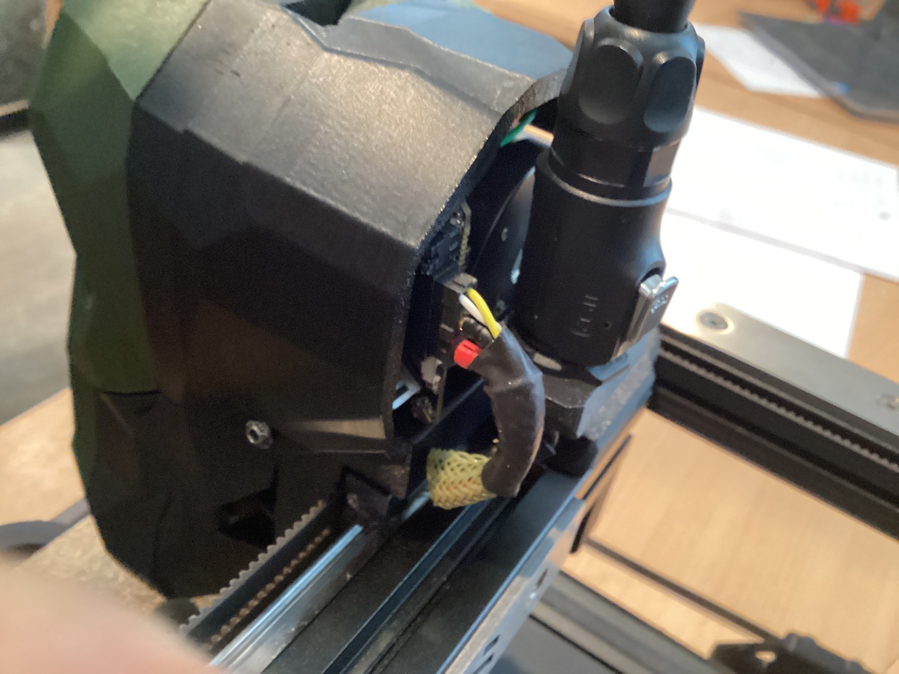

# CAN bus umbilical

## Why?
After implementing the Mellow Fly SB2040, I decided to implement an umbilical because I had 3 wires fail in my X drag chain within a span of 4 months...

## The plan
- Move the X endstop to the right X-carriage mount (It already has a spot to mount the switch)
- Move the Y endstop to the A motor mount
- Remove the X and Y drag chains
- Need mounts for both ends of the umbilical cable
- Build the umbilical cable
- Hook it all up and enjoy all the hard work!

### Move the X endstop
- This was very easy to do since the Voron 2.4r2 X-carriage already has a spot to mount the switch.
- Connected the X endstop switch wires to the gpio29 enstop connection on the SB2040

### Move the Y endstop
- This was more involved than I expected
- I used hartk's modified A motor top plate
  - https://github.com/hartk1213/VoronUsers/blob/master/printer_mods/hartk1213/Voron2.4_Y_Endstop_Relocation/STLs/Gantry/AB_Drive_Units/a_drive_frame_upper_with_jst_y_endstop.stl
  - This was very involved and took some time since I had to replace it on a completed printer
  - In hindsight, if I had to do it again, I would probably use one of the following two solutions, so that I would not have to swap the entire top A motor mount:
    - https://github.com/cruiten/Voron-Related/blob/main/CANbus/Umbilical/STLs/a_drive_umbilical_pg7_y_endstop.stl
    - https://github.com/Minsekt/moronvods/blob/main/Rear_Umbilical/Y_Endstop_Relocation/STL/y_endstop.stl
    
    
### Remove the X and Y drag chains
- Felt good to remove these
- I actually ended up replacing my Z drag chain with one of the removed drag chains since they are "skinnier" than the Z drag chain, and with CAN bus there are far fewer wires...

### Umbilical Mounts
**Toolhead Mount**

- For the toolhead mount I printed this: https://github.com/hartk1213/MISC/blob/main/Voron%20Mods/Voron%202/2.4/CW2_SB2040_CAN_Umbilical/STLs/cw2_umbPG7_skinnyy.stl
  - I needed the "skinny" version, because the original version was interfering with the Z drag chain and the PG7 gland on top of the A motor plate
- I purchased a four-pin M12 Aviation connector and mounted the female socket on the toolhead mount
  -   https://www.amazon.com/dp/B087MZYG37?psc=1&ref=ppx_yo2ov_dt_b_product_details
- I used the original connector and wiring that came with the SB2040
  - I shortened the wiring and soldered the wires to the female M12 Aviation connector

**A Motor Mount**

The other side of the umbilical is connected to a PG7 gland that is mounted on top of the A motor mount.

- For this mount I printed this: https://github.com/cruiten/MISC/blob/main/Voron%20Mods/Voron%202/2.4/CW2_SB2040_CAN_Umbilical/STLs/v2_a_drive_pg7_umbilical.stl
  - I had to modify hartk's original design because the Ti backer plate mounted on the back of my X-axis interfered with the printed part
  - I created a pull request (PR) to hartk, but as of today hartk has not reviewed that PR so that is why this is not on hartk's github
- I mounted this PG7 gland on the mount: https://www.amazon.com/gp/product/B09GV9Q79C/ref=ppx_yo_dt_b_search_asin_title?ie=UTF8&psc=1

### Umbilical Cable
I used the following parts to build my umbilical cable:
- Aforementioned 4-pin M12 aviation connector: https://www.amazon.com/dp/B087MZYG37?psc=1&ref=ppx_yo2ov_dt_b_product_details
- IGUS CF77-UL-05-04-D: https://www.igus.com/product/994?artNr=CF77-UL-05-04-D
- Titan Rig MDPC-X Medium cable sleeving: https://www.cable-sleeving.com/cable-sleeving-m
- Molex Micro-Fit 3.0 dual row connector: https://www.amazon.com/dp/B078Q798L9?psc=1&ref=ppx_yo2ov_dt_b_product_details
- Large shrink wrap from my local hardware store

I soldered the wires from one end of the umbilical to the male M12 aviation connector, and I connected the Molex Micro-Fit 3.0 connector to the other end of the umbilical below the PG7 gland that is mounted on top of the A motor.

I finished it off with large shrink wrap to make the ends look nice and tidy.

The IGUS cable is nice and rigid and supports the umbilical cable very well in my Voron 2.4r2 300x300 printer.

### Hooking it all up
The only thing left to do was to get some PTFE wires and connect those to the umbilical cable's Molex Micro-Fit 3.0 connector and route them through the Z drag chain and connect them to my Mellow Fly UTOC-1.

- I used two 24 gauge PTFE wires for the CAN bus H and L wires (I twisted these two wires around each other)
- I used two 20 gauge PTFE wires for the CAN bus 24V and GND wires (I did not twist these two wires around each other)

Here is a wiring diagram of how I connected the SB2040 to the UTOC-1:

  
