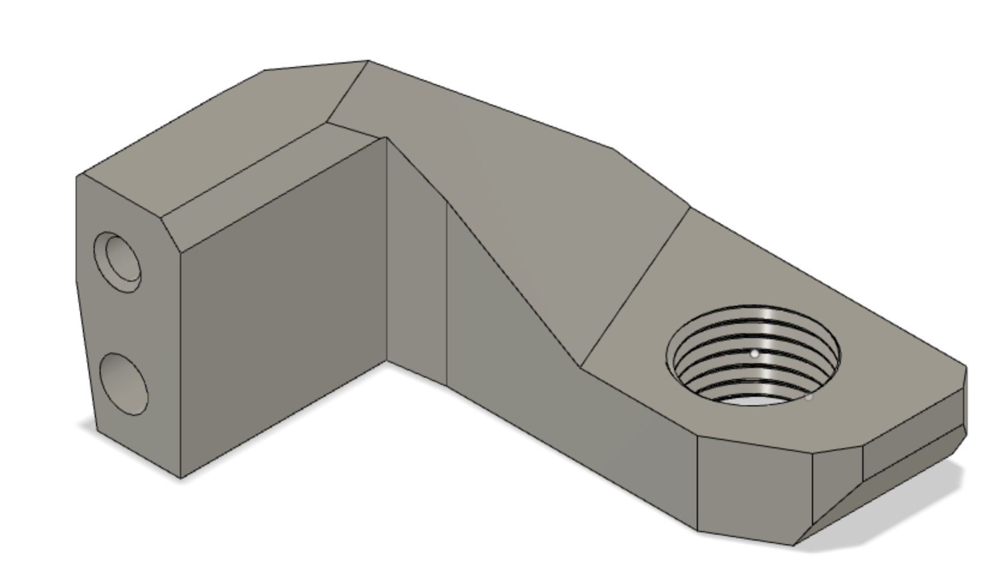
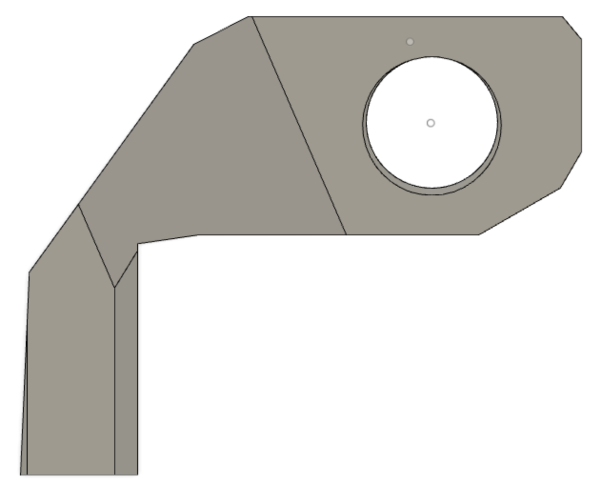
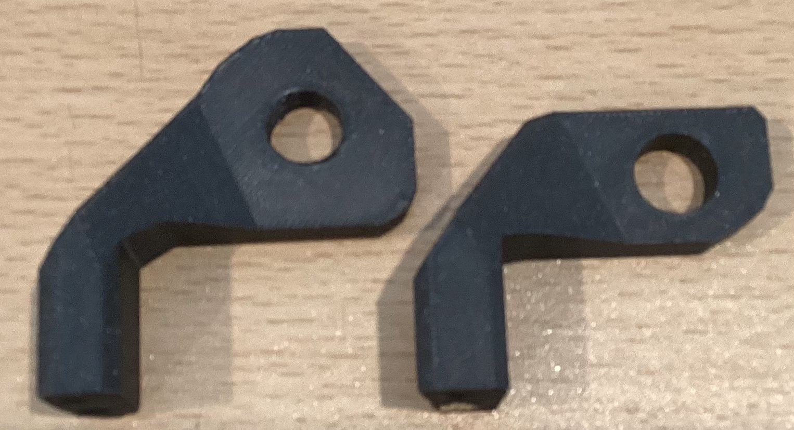

# A drive umbilical + Y endstop
## Why?
Created this to help out Discord user @DraHrEg.

I "married" hartk's "A_drive_Umbilical_PG7" and minsekt's "Y-endstop" designs.

I wish this was available when I was doing the umbilical set up for my Voron 2.4r2, because replacing the upper A drive motor plate was quite involved and required more effort than I had planned for.

The PG7 cable gland is a tight fit, so be sure to print this part using the recommend Voron print settings.

P.S. This design probably needs to be updated a bit to allow for better wire management from the switch to the area where the PG7 gland is...

# Umbilical mount for Clockwork 2 - Skinny Y version
## Why?
Modified hartk's version so that it would not crash into the Z-chains and the umbilical gland mounted on the A-motor plate during homing.

