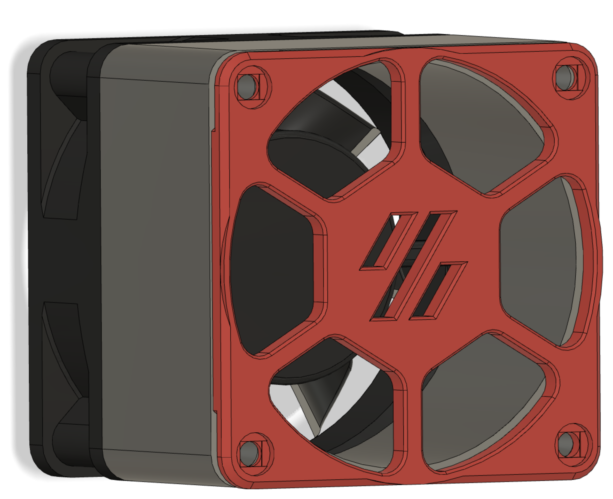
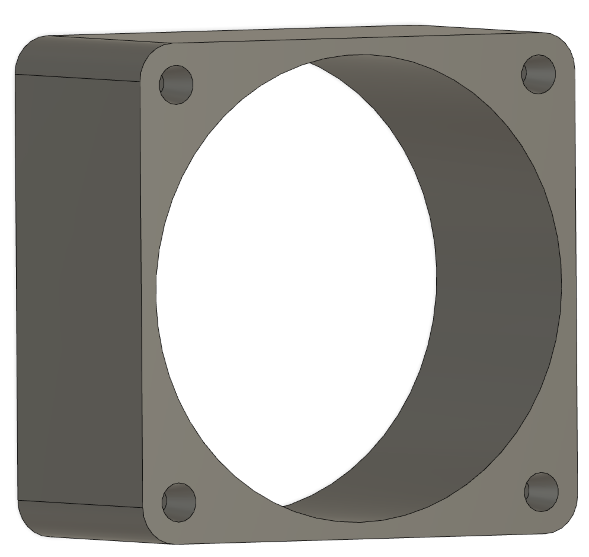

# Loud Electronics Bay Fans?
The two Noctua fans that I am using are nice and quiet, until I installed them in my printer. To be more accurate, they were quiet until I mounted the grills in front of them. The grills created air turbulence which resulted in "noise"...

I was thinking of not using the fan grills, but decided against this idea because I realized that I could use some help to prevent me from accidentally putting my fingers into the exposed fans...

One side benefit of these fan silencer spacers is that they help to hide the visible tan color of the Noctua fan bodies, which is not in my printer's color palette.

If you don't have M3x40 bolts, simply install four heatsets on both sides of the fan silencer spacer body so that you can mount with shorter bolts like M3x8.

