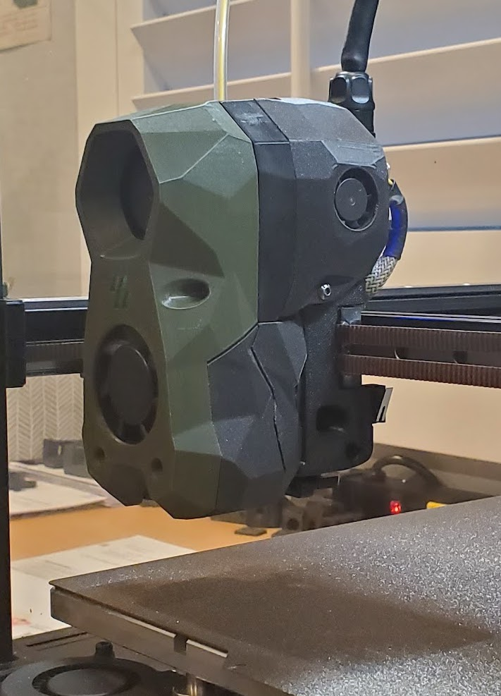

# SB2040 Fan Cover



&nbsp;

Many people are concerned that the SB2040 will overheat because it is enclosed by the Stealthburner latch cover.

My SB2040 has never exhibited any overheating problems. In fact, my SB2040 MCU temperature has never reported higher than 79.4C with chamber temperatures ranging between 65C to 70C.

This is the primary reason why I never considered adding active cooling for the SB2040. Although, a close runner-up reason was the fact that I did not like the aesthetics of the solutions people created to put a small fan in the Stealthburner latch cover...

All this changed when I came across a solution designed by QUINX on the Voron Design Discord server.

This design retained the clean lines of the Stealthburner design while incorporating a small 2006 fan.

While it is true that the 2006 is not as readily available as other fans, in my opinion it is worth the wait to order the fan from AliExpress.

I purchased my 2006 fans from [AliExpress](https://www.aliexpress.us/item/3256803197654720.html?spm=a2g0o.order_list.order_list_main.29.3dbf180286hNOG&gatewayAdapt=glo2usa&_randl_shipto=US)

&nbsp;

-----

&nbsp;

## Installation 
- The 2006 fan is a press-fit on the SB2040 Fan Cover printed part.

&nbsp;

- You will have to solder the two wires from the 2006 fan to the FAN2 pads on the SB2040
  - Just make sure to use the 5V and AGND pads.

&nbsp;

- The last thing I did was to add the following fan definition to my Klipper printer configuration:
    ```sh
    [heater_fan Toolhead_fan]
    pin: sb2040:gpio15  #CANBUS FAN2
    max_power: 1.0
    kick_start_time: 0.5
    heater: extruder
    heater_temp: 50.0
    ```

    This means that the SB2040 fan will turn on when the hotend temperature is above 50C.