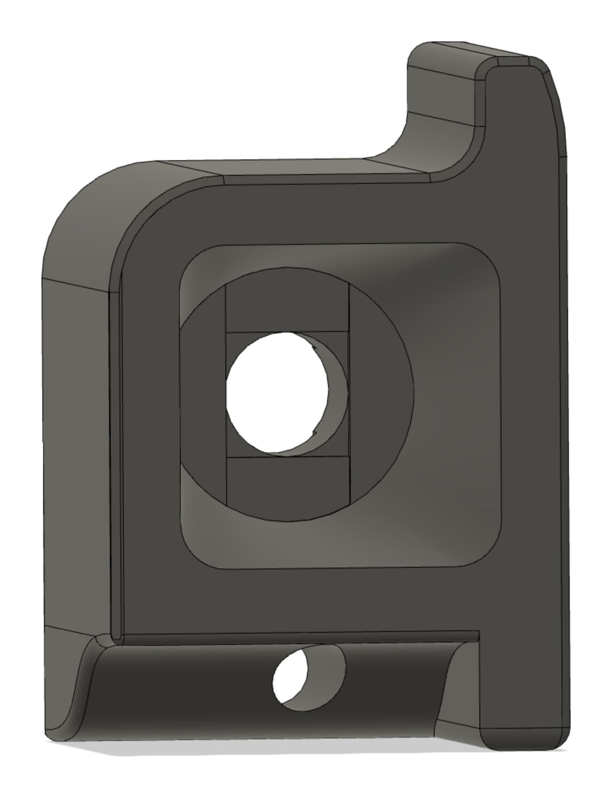

# Interested in seeing your chamber temperature?

I remixed the standard Voron 2.4r2 Z-Chain Guide to incorporate a place for a ATC Semitec 104NT-4-R025H42G thermistor.

This is the corresponding section from my configuration file that I used with my Octopus v1.1:

````[temperature_sensor chamber]
## Chamber Temperature - Z Chain Guide
sensor_type: ATC Semitec 104NT-4-R025H42G
sensor_pin: PF6
min_temp: 0
max_temp: 100
gcode_id: chamber
````


